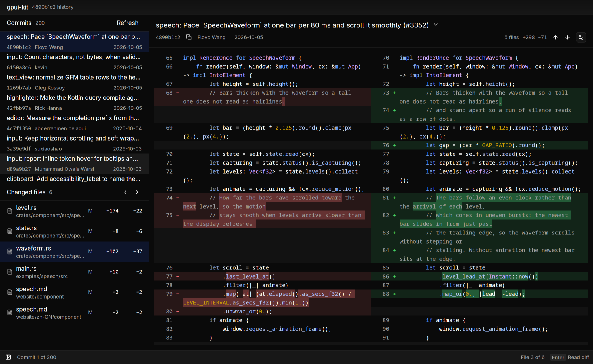

# Git history

A small desktop Git browser inspired by tig. Browse the latest 200 commits
reachable from HEAD, inspect each file in `Diff`, and jump between the commit’s
changed files. Commit and file navigation share a resizable sidebar; the diff
owns the main work area. The commit body opens from the disclosure beside the subject. Dark appearance and
Split layout are the defaults.

```sh
cargo run -p example-tig -- .
cargo run -p example-tig -- /path/to/repository
cargo run -p example-tig --features gpui-fast -- .
```

Git must be on PATH. The argument defaults to the current directory and may
point inside a working tree or to a bare repository. No repository files are
written. This example browses committed history; it does not stage changes,
checkout branches, edit source, or show uncommitted work.

## Using it

Select a commit in **Commits**, then a file in **Changed files**. The viewport
shows only the selected file, so its header and source always share the same
scope. Selecting a file again reveals its header and expands it if collapsed.
The selected commit shows its subject, author, date and short hash above the
diff. The copy button next to the hash copies the full object ID.
The disclosure beside the subject reveals the remaining commit message in a
separate, scrollable region without displacing the code by default.

**Diff display options → Unified / Split** changes the layout while retaining source selection.
Use the arrow buttons or n / Shift+N to navigate change groups in the selected file.
The settings icon opens **Diff display options**, containing
wrapping, line numbers, inline word/grapheme emphasis and context expansion. Its Appearance submenu switches between Light and Dark.
These choices update the retained state rather than replacing it. Long lines
wrap by default. Diff retains its themed added/deleted line backgrounds, gutter
signs and inline emphasis so changes remain easy to scan.

| Context | Key | Result |
| --- | --- | --- |
| Commits | ↑ / ↓ or k / j | Select the newer / older commit |
| Commits | Enter | Focus the diff |
| Changed files | ↑ / ↓ or k / j | Reveal the previous / next file |
| Changed files | Enter | Focus the diff |
| Anywhere | [ / ] | Reveal the previous / next file |
| Anywhere | Escape | Show the sidebar and return to commit history |
| Anywhere | Cmd+B / Ctrl+B | Show / hide the sidebar |
| Anywhere | n / Shift+N | Reveal the next / previous change |
| Anywhere | Cmd+R / Ctrl+R | Refresh history, retaining the selected commit when available |
| Anywhere | Cmd+Shift+C / Ctrl+Shift+C | Copy the commit's full hash |
| Diff | Cmd+C / Ctrl+C | Copy selected source |
| Anywhere | Cmd+Q / Ctrl+Q | Quit |

Tab moves between command buttons, the history, files and the diff. Vertical
wheel input scrolls source rows; horizontal gestures scroll long lines. The
sidebar's two sections and its width can be resized independently. The status
bar offers a sidebar toggle. Clicking a file keeps focus in the file list;
Enter moves into source. Keyboard focus is shown on the active row rather than
around the whole navigation pane. Shortcut tooltips and status hints use `Kbd`
resolved from the actual Actions. The status bar reports the commit/file position
and the current source selection.

## Input and state

`repository.rs` runs `git log` and `git show` on the background executor. Log
records use NUL delimiters so tabs, Unicode and empty commit subjects remain
valid. The patch is parsed into `DiffFile`s off the UI thread. Merge commits
are compared to their first parent, producing an ordinary two-sided patch.
Root commits, renames, deletions, binary summaries and metadata-only changes
use the same parser as other Diff applications.

`Tig` owns the commit list, selection, focus handles, two virtualized navigation
lists and one `Entity<DiffState>`. Changing commits clears old source immediately.
Each request carries a revision: a result from an earlier selection cannot
overwrite the current one. A refresh retains the selected hash when it is
still in the history window.

Only context supplied by Git is available. Expanding a fold cannot recover
missing lines. There is no source comparison or repository access inside
`Diff` itself. Non-UTF-8 patch output produces an error instead of silently
changing the source. Empty repositories and commits without file changes have
distinct empty states; read errors offer **Retry**.

To check repository loading without opening a window:

```sh
cargo run -p example-tig -- --check /path/to/repository
```

The example includes parser regression tests and production-view UI integration
tests for commit/file navigation, startup file selection, stale-result rejection,
focus and independent commit-message scrolling.

## Showcase

Open a real Rust change at a reproducible position:

```sh
cargo run -p example-tig -- --commit 4890b1c2 --file crates/component/src/speech/waveform.rs --line 70 .
```

`--commit` accepts a 7–64 character hexadecimal object ID and starts history
from that commit. `--file` selects a changed file; `--line` reveals a one-based
modified-side source line and requires `--file`. These startup choices do not
restrict subsequent navigation.



Earlier screenshots remain available: [initial preview](screenshots/before.png)
and [intermediate preview](screenshots/unified.png).

[中文说明](README.zh-CN.md)
